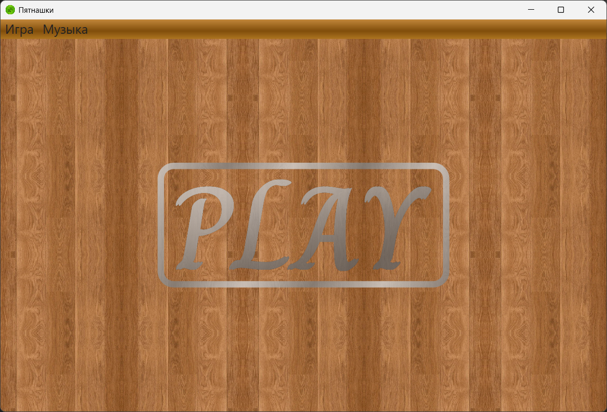
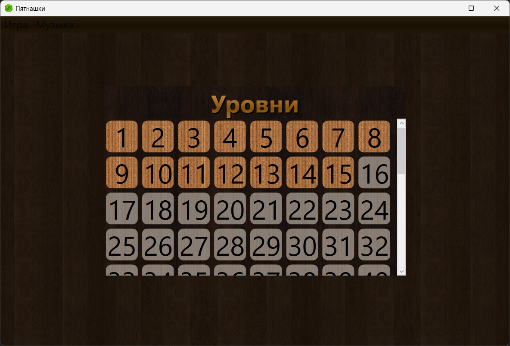
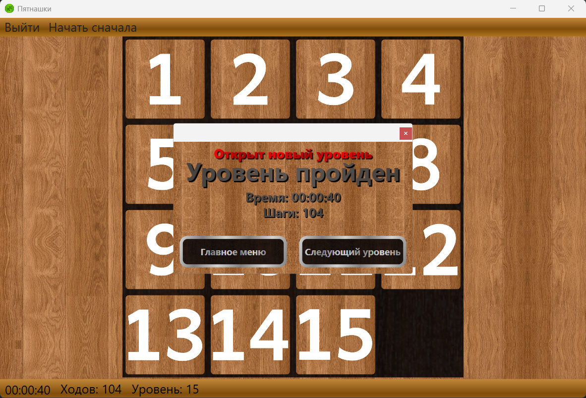

# Игра пятнашки.

Кратко:
1. 100 уровней.
2. Решение головоломки вручную.
3. Подсчёт и сбор статистики: время решения и количество ходов.

___

Для запуска скопировать папку `Resources` в папку с исполняемым файлом.